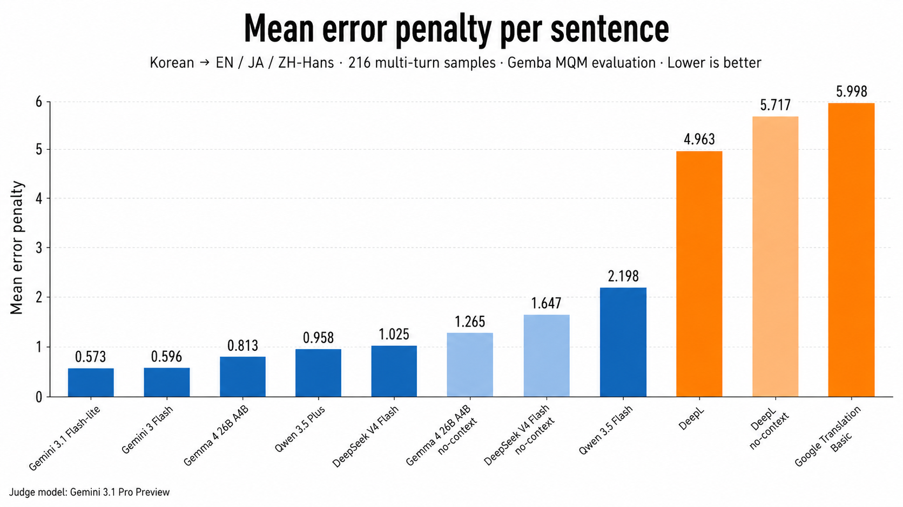
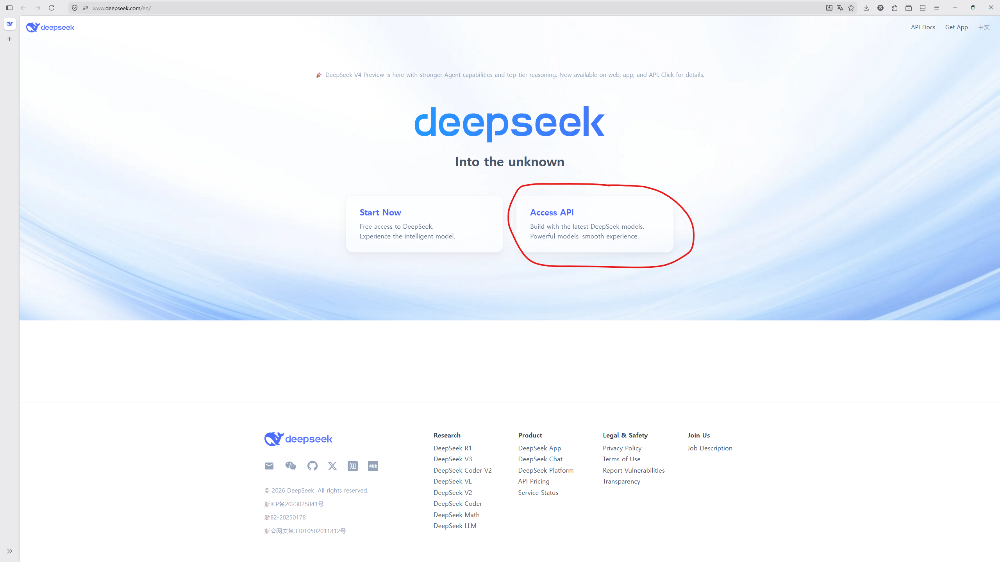
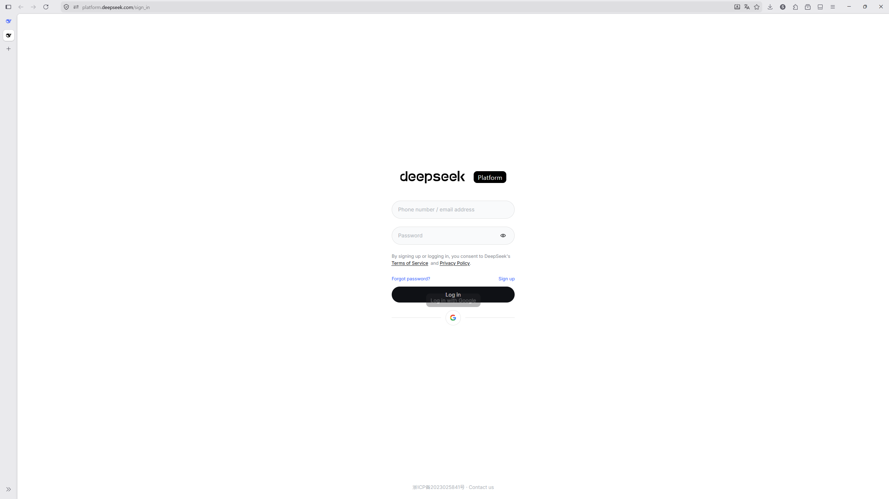
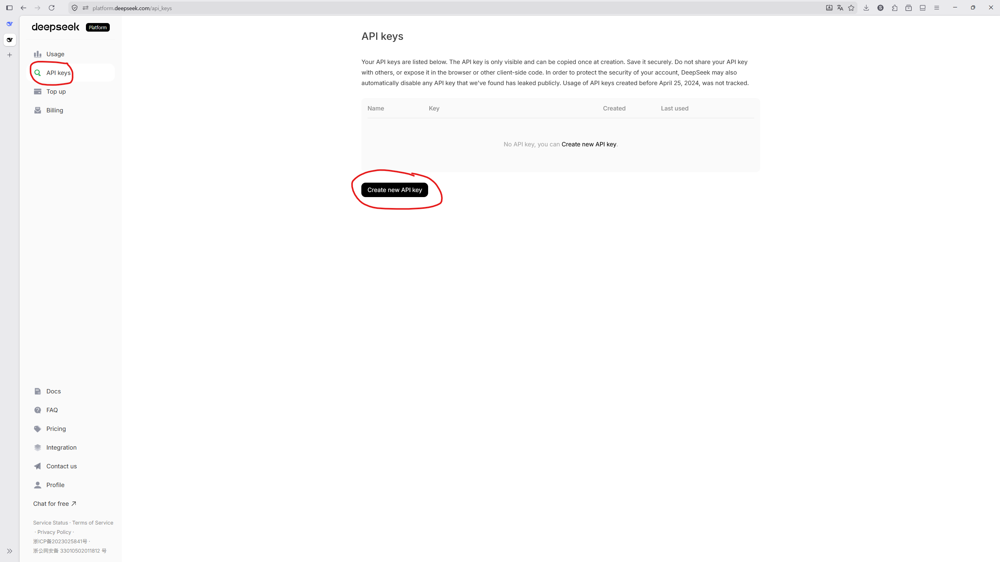
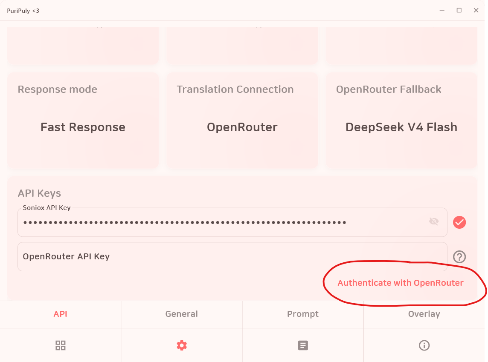
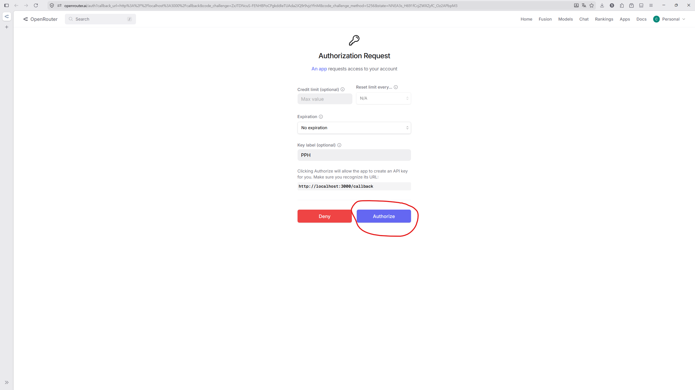
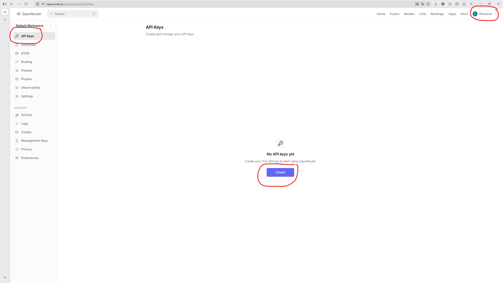
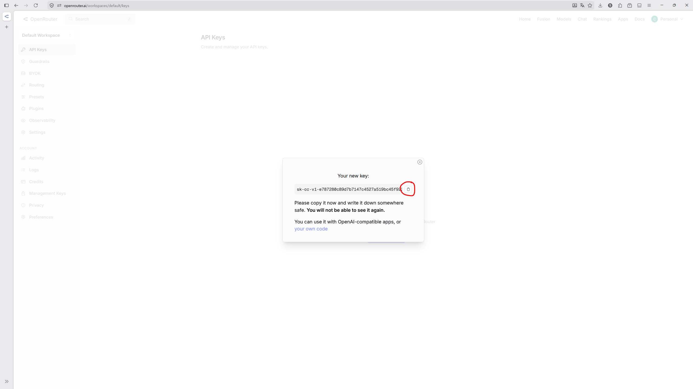

<p align="center">
  
</p>

<h1 align="center">PuriPuly <3</h1>

<p align="center">
  
  
  
  
</p>

<p align="center">LLM-based two-way translator for VRChat</p>

<h2 align="center">
  <a href="README.md">🇺🇸 English</a> ·
  <a href="README.ko.md">🇰🇷 한국어</a> ·
  🇯🇵 日本語 ·
  <a href="README.zh-CN.md">🇨🇳 简体中文</a>
</h2>

---

## Demo


---

<video src="https://github.com/user-attachments/assets/c667f44d-b91d-42a9-b24a-e6a993b392d3" controls width="100%"></video>

デモ動画のYouTubeリンク:
- [デモ 1](https://www.youtube.com/watch?v=3p0CamYui0o)
- [デモ 2](https://youtu.be/DoX36Y7J_lc?si=YjbeVTS8v3jGQB1w)

---

## Finally, talk like real friends.

慰めたかったのに、  
「大丈夫？」としか声がかけられなかったこと、ありますよね。

伝えたい気持ちが、  
ただの「翻訳機」じゃ届かないこと、わかってますよね。

だから、作ったんです。

- **LLMベースのローカライズ** — スラング、口語、タメ口/敬語まで自然に
- **文脈の記憶** — 前後の流れを踏まえた自然な会話を維持
- **双方向の音声翻訳** — 相手の音声も一緒に翻訳、VR字幕オーバーレイ対応
- **Discordで始められる** — 複雑な設定なしですぐに使える

## Q&A

- **翻訳の品質はどのくらいですか？**
→ お互いにこの翻訳機を使えば、深い話までできるくらいです。定量的にはGemma 4でDeepLより6倍良い結果でした。詳しくは下の「翻訳比較」をご覧ください。

- **話してから翻訳されるまでどのくらいかかりますか？**
→ Gemma 4とクラウドSTTを使った場合、遅延は通常1秒中盤〜後半くらいです。

- **使うのにお金はかかりますか？**
→ はい、でも後からです。新規ユーザーには無料の使用枠が用意されています。それ以降もとても安く、1ドルで数千回使えます。

- **APIキーを発行する必要がありますか？**
→ はい、でもこれも後からです。最初はインストールしてDiscordで認証するだけで使えます。

- **相手の音声を翻訳する機能の完成度はどのくらいですか？**
→ 騒音の少ない1対1の環境で最もよく動作します。3人までなら問題ない場合もありますが、保証はできません。VRChatで使う場合は、Earmuff機能を使って環境をコントロールしてください。

- **音声認識がうまくいきません / 遅いです**
→ ローカルのQwen ASRを使っている場合は、クラウドSTTに切り替えるのをおすすめします。

- **音声や会話の内容はどう扱われますか？**
→ 自分の文字起こしと翻訳結果のみがローカルに保存されます。相手の音声・文字起こし・翻訳結果は記録しません。ただし、STTサービスと翻訳プロバイダーがデータを処理することがあります。

### [📥 ダウンロード](https://github.com/kapitalismho/PuriPuly-heart/releases/latest)

---

## 翻訳比較


- マイクロソフトのGemba MQMフレームワークを使って実験しました。
- 実際の会話に近づけるため、マルチターン環境で構成しました。
- 全体の実験結果は[こちら](https://github.com/kapitalismho/korean-llm-context-translation-benchmark)を参照してください。

## コスト

### 1ドルあたりの使用可能回数

| LLM \ ASR | Qwen ASR (Local) | Qwen ASR (Cloud) | Soniox | Deepgram |
|---|---|---|---|---|
| **Gemma 4 26B A4B** | 8,350回 | 2,530回 | 3,130回 | 1,120回 |
| **DeepSeek V4 Flash** | 6,110回 | 2,280回 | 2,750回 | 1,070回 |
| **Gemini 3 Flash** | 1,630回 | 1,130回 | 1,230回 | 720回 |
| **Gemini 3.1 Flash-Lite** | 3,260回 | 1,720回 | 1,970回 | 930回 |
| **Qwen 3.5 Plus** | 7,090回 | 2,400回 | — | — |
| **Local LLMs (Ollama)** | 無制限 | 3,660回 | 5,000回 | 1,290回 |

### 発話あたりのコスト

| LLM \ ASR | Qwen ASR (Local) | Qwen ASR (Cloud) | Soniox | Deepgram |
|---|---|---|---|---|
| **Gemma 4 26B A4B** | ~0.02円 | ~0.06円 | ~0.05円 | ~0.14円 |
| **DeepSeek V4 Flash** | ~0.03円 | ~0.06円 | ~0.06円 | ~0.14円 |
| **Gemini 3 Flash** | ~0.09円 | ~0.14円 | ~0.12円 | ~0.21円 |
| **Gemini 3.1 Flash-Lite** | ~0.05円 | ~0.09円 | ~0.08円 | ~0.17円 |
| **Qwen 3.5 Plus** | ~0.02円 | ~0.06円 | — | — |
| **Local LLMs (Ollama)** | 0円 | ~0.04円 | ~0.03円 | ~0.12円 |

*   *（入力 950トークン + 出力 12トークン）× 発話1回あたりの平均LLM呼び出し回数 1.2回と仮定*
*   *1ドルあたりの使用可能回数は、発話あたりのコスト表の四捨五入前の値を基準に算出*
*   *すべてのコストと使用可能回数は概算*
*   *キャッシュヒットによる入力コスト削減は考慮していません*
*   *Qwen APIコストは北京リージョン基準*
*   *料金表基準: 2026年5月3日 / 高速応答モード有効時*
*   *1ドル = 150円*

### 無料クレジット

| サービス | 無料クレジット | 期限 | 備考 |
|--------|------------|------|------|
| **Deepgram** | $200 | なし | - |
| **Gemini** | $10 | 1年 | 毎月付与 |
| **Qwen** | モデルごと100万トークン | 90日 | シンガポールリージョン基準 |

---

# 問題が起きたり、分かりにくいところがあれば、気軽に[Twitter/X](https://x.com/kapitalismho)でDMしてください。

## 使い方

1. [ダウンロードページ](https://github.com/kapitalismho/PuriPuly-heart/releases/latest)から最新バージョンをダウンロード
2. PuriPulyをインストール
3. **STT** ボタンをクリック
4. **TRANS** ボタンをクリックしてDiscord認証

   > 翻訳モデルがGemma 4またはDeepSeekで、接続方式がマネージドの場合のみDiscord認証が可能です。

5. **Subtitles** ボタンを押してVR字幕をオン
6. （任意）**Peer** ボタンを押して相手の音声翻訳をオン

   > 相手の音声翻訳機能がきちんと動作するには、騒がしくない環境が必要です。VRChatで使う場合は、Earmuff機能を使って環境をコントロールしてください。

7. VRChatでOSCを有効化: Action menu → Settings → OSC → Enable

* 音声が認識されない場合は、PuriPulyの設定タブで正しいマイクを選択してください。

---

### 中国のユーザーへ向けた案内

Soniox / Gemini / Deepgramへのアクセスがブロックされている地域の場合は、以下の組み合わせをお使いください。

- STT: **Qwen ASR**
- LLM: **DeepSeek V4 Flash** または **Qwen 3.5 Plus**

   > マネージド接続方式を使う場合は、**マネージド** ではなく **マネージド（中国）** を選んでください。

---

### 自分のAPIキーを使う

利用するサービスに合わせて、適切なガイドを見ながら進めてください。

OpenRouter経由でGemma 4モデルを使うことをおすすめします。

もしよければ、設定するついでに、STT側も一緒に設定しませんか？
PuriPulyはクラウドSTTと組み合わせると最良の体験になります。
たとえば同じQwen ASRでも、ローカルとクラウドでは音声認識性能にかなり差があります。

まずはDeepgramから始めるのをおすすめします。
登録するだけで200ドル分の無料クレジットがもらえます。

<details>
<summary><h3>Deepgram</h3></summary>

1. [Deepgram Console](https://console.deepgram.com/)にアクセスしてログインします。
   

2. 歓迎メッセージとアンケートが表示されたら、**Skip** を押してスキップします。
   

3. サービス選択画面で **STT (Speech-to-Text)** を選択します。
   

4. API Keysメニューで **Create a New API Key** をクリックします。
   

5. キーの名前を入力し（例：`puripuly`）、作成します。
   

6. 作成されたキーをコピーして、PuriPulyの設定に貼り付けます。
   

</details>

<details>
<summary><h3>Gemini</h3></summary>

1. [Google AI Studio](https://aistudio.google.com/apikey)にアクセスし、**Get API key** ボタンをクリックします。
   

2. 新しいプロジェクトを作成します。
   

3. 任意の名前を付けます。
   

4. 作成したプロジェクトを選択し、**Create key** を押します。
   

5. 丸で囲まれた部分を押します。
   

6. 丸で囲まれた部分を押してキーをコピーします。
   

7. （推奨）黄色で強調表示されている **Set Up Billing** ボタンを押し、有料プランに切り替えます。
プラン切り替えには少し時間がかかることがあります。
   

<details>
<summary><h3>Geminiの有料サブスクリプションをお持ちの方</h3></summary>

8. [Google Developer Program](https://developers.google.com/program/my-benefits) にアクセスし、プログラムに参加してください。
   

9. ステップ7で設定した有料プランのプロジェクトを選択してください。
   

</details>

</details>

<details>
<summary><h3>DeepSeek</h3></summary>

1. [DeepSeek公式サイト](https://www.deepseek.com/en/)にアクセスし、**Access API** ボタンをクリックします。
   

2. サイトでログインします。
   

3. API Keysタブに移動して **Create new API Keys** を押します。
   

4. ボタンを押してAPIキーをコピーし、翻訳機のAPIタブに貼り付けます。
   

5. Top Upタブに移動し、使う分だけ前払いでチャージします。
   

</details>

<details>
<summary><h3>OpenRouter</h3></summary>

1. アプリ内で赤い丸の中のボタンを押します。
   

2. OpenRouterでログインします。
   

3. 赤い丸の中のボタンを押して決済画面を抜けます。
   

4. **Authorize** ボタンを押します。
   

5. 使う分だけ前払いでチャージします。
   

<details>
<summary><h3>Authorizeボタンを押しても認証されない場合</h3></summary>

Authorizeボタンを押しても認証されない場合は、再試行するか、以下の手順で直接APIキーを発行して貼り付けてください。

6. 右上のアカウントをクリックし、左のAPI Keysタブを開いて、中央のCreateボタンを押します。
   

7. Createボタンを押します。
   

8. ボタンを押してAPIキーをコピーし、翻訳機のAPIタブに貼り付けます。
   

</details>

</details>

<details>
<summary><h3>Qwen</h3></summary>

1. 地域に合った経路でAlibaba Cloud Model Studioにアクセスします。
   - [中国本土](https://bailian.console.aliyun.com/cn-beijing)
   - [中国本土以外の地域](https://bailian.console.alibabacloud.com)

2. アクセスしたアドレスからログインします。APIキーを発行したいリージョン（Region）を正確に選択してください（例：Beijing）。
   

3. 右上の **歯車アイコン** をクリックします。
   

4. ワークスペースを作成し、**API-KEY** ページに移動します。
   

5. **Create API Key** をクリックします。
   

6. アカウントとワークスペースを割り当てて、OKボタンを押します。
   

7. 丸で囲まれた部分を押してキーをコピーします。
   

</details>

<details>
<summary><h3>Soniox</h3></summary>

1. [Soniox Console](https://console.soniox.com/)にログインします。
   

2. 組織の名前を任意で入力します。
   

3. **Add Funds** ボタンを押し、支払い方法を登録します。
   

4. Sonioxはプリペイド方式のチャージが必要です。チャージ完了後、**API Keys** メニューへ移動します。
   

5. 新しいAPI Keyを作成します。
   

6. 作成されたキーをコピーして、PuriPulyの設定に貼り付けます。
   

</details>

---

## 開発

### 開発環境のまとめ

| 領域 | 推奨環境 |
|---|---|
| Python アプリ | Windows |
| VR オーバーレイ | Windows |
| Broker サービス | Linux / WSL |

### Python アプリ

```bash
python -m venv .venv
.venv\Scripts\activate  # Windows
```

```bash
# pip
pip install -e '.[dev]'

# または uv
uv sync --dev
```

```bash
pre-commit install
```

### GUI 実行

```bash
# 仮想環境を有効化した後
python -m puripuly_heart.main run-gui

# または uv で実行
uv run python -m puripuly_heart.main run-gui
```

```bash
# 隠れたUIを確認可能
python -m puripuly_heart.main run-gui --debug-ui-preview
```

### テストとリント

```bash
black src tests          # フォーマット
ruff check src tests     # リント
python -m pytest         # テスト（仮想環境での実行を推奨）
```

### VR オーバーレイ

VR字幕オーバーレイは `native/overlay/` のRustプロジェクトでビルドします。

```powershell
cargo test --manifest-path native/overlay/Cargo.toml -q

cargo build `
  --manifest-path native/overlay/Cargo.toml `
  --locked `
  --release `
  --bin PuriPulyHeartOverlay `
  --target-dir target

New-Item -ItemType Directory -Force -Path build/overlay | Out-Null
Copy-Item target/release/PuriPulyHeartOverlay.exe build/overlay/PuriPulyHeartOverlay.exe -Force
Copy-Item third_party/openvr/win64/openvr_api.dll build/overlay/openvr_api.dll -Force

.\build\overlay\PuriPulyHeartOverlay.exe --check-startup-contract
```

### Broker サービス

詳しくは `broker/README.md` を参照してください。

```bash
pnpm install --frozen-lockfile
pnpm run typecheck
pnpm exec vitest run
pnpm --filter @puripuly-heart/broker run verify:config
pnpm --filter @puripuly-heart/broker run dev
```

---

## 開発者

[salee](https://github.com/kapitalismho)

---

## コントリビューター

[RICHARDwuxiaofei](https://github.com/RICHARDwuxiaofei)

---

## Special Thanks

<!-- ALL-CONTRIBUTORS-LIST:START - Do not remove or modify this section -->
<!-- prettier-ignore-start -->
<!-- markdownlint-disable -->
<table>
  <tbody>
<tr>
      <td align="center" valign="top" width="25%"><br /><sub><b>SUI_32C</b></sub></td>
      <td align="center" valign="top" width="25%"><br /><sub><b>Nagikokoro</b></sub></td>
      <td align="center" valign="top" width="25%"><br /><sub><b>motoka96</b></sub></td>
      <td align="center" valign="top" width="25%"><br /><sub><b>_Ykol魚</b></sub></td>
    </tr><br />
    <tr>
      <td align="center" valign="top" width="25%"><br /><sub><b>kascr_</b></sub></td>
      <td align="center" valign="top" width="25%"><br /><sub><b>Just Monika V</b></sub></td>
      <td align="center" valign="top" width="25%"><br /><sub><b>FLUVIA</b></sub></td>
      <td align="center" valign="top" width="25%"><br /><sub><b>Han โชเล่ย์</b></sub></td>
    </tr>
  </tbody>
</table>


<!-- markdownlint-restore -->
<!-- prettier-ignore-end -->

<!-- ALL-CONTRIBUTORS-LIST:END -->

---

## ライセンス

[AGPL-3.0-or-later](LICENSE)

サードパーティライセンスおよび通知: `src/puripuly_heart/data/THIRD_PARTY_NOTICES.txt`
